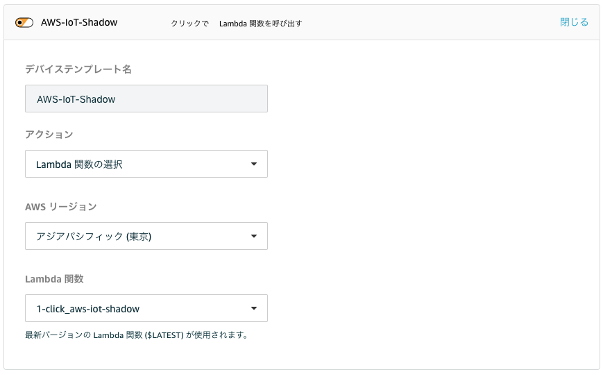
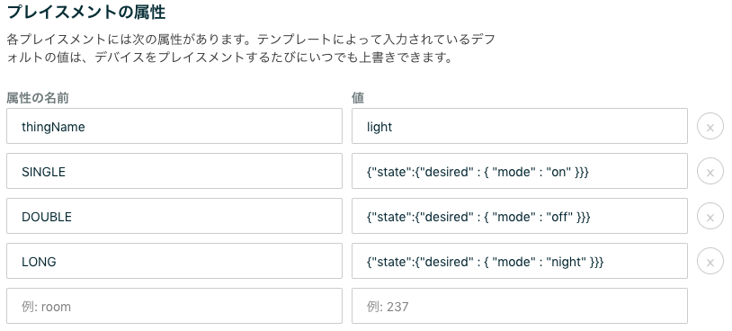
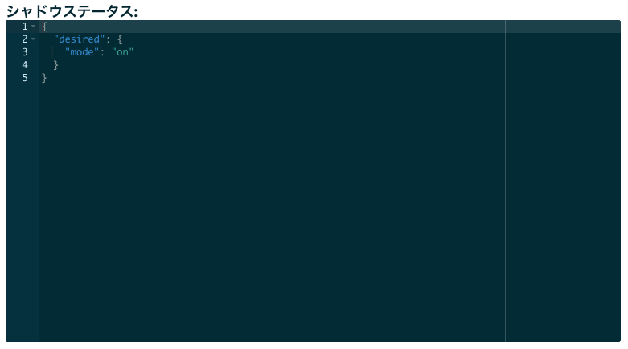

# AWS IoT 1-Click サービスから Thing Shadow をアップデートする

## 準備
- AWS IoT Core で Thing を作成する
ThingName は、`deviceId` または、`thingName` 属性で指定するものと一致する必要がある

- AWS IoT Core の カスタムエンドポイント を確認する(オプション)
> AWS IoT ＞ 設定 から確認出来ます  
> 無指定の場合、data.iot.ap-northeast-1.amazonaws.com が使われます

## 使い方
### AWS Lambda の設定 (オプション)
`ENDPOINT` 環境変数として上記で確認した `xxxxxx-ats.ap-northeast-1.amazonaws.com` を指定します

### AWS 1-click 側の設定
- [AWS IoT 1-Click のコンソール](https://ap-northeast-1.console.aws.amazon.com/iot1click/home)を開きます。
- デバイスを登録します
- [プロジェクトを新規作成します](https://ap-northeast-1.console.aws.amazon.com/iot1click/home?region=ap-northeast-1#/create/project)
 - プロジェクト名 : `AWS-IoT` など
- プロジェクトのプレイスメントのテンプレートの定義 をします。
 - デバイステンプレート定義
 
 - プレイスメントの属性
 
   - 共通で使う属性の設定となります(それぞれをプレイスメント毎に上書きすることも出来ます)
   - `thingName` には準備で作成した Thing の名前を指定します
   - SINGLE/DOUBLE/LONG には、それぞれのクリックタイプの時に送信したい Device Shadow Service Documents を指定します

 > thingName も SINGLE/DOUBLE/LONG も省略した場合は、ボタンのデバイス名の Thing に対して、クリックタイプをレポートするような動作になります

- プレイスメントを作成します
  - プレイスメントごとの属性をここでオーバーライドすることが出来ます

### AWS IoT 側でデータを確認する
AWS IoT のメニューから 管理 > モノ > Thing名 をクリックし、シャドウをクリックすると下記のようにシャドウのステータスが変更される様子がわかります

