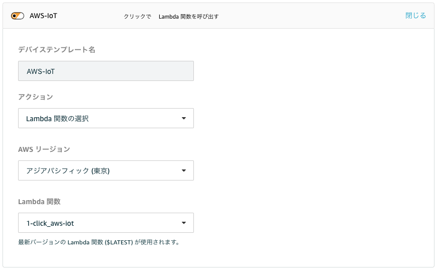
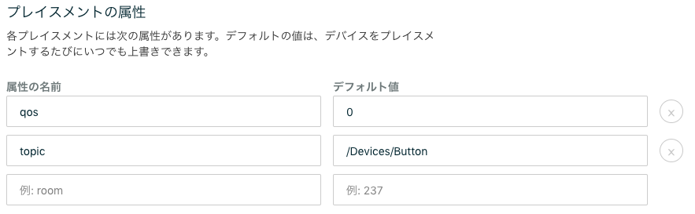
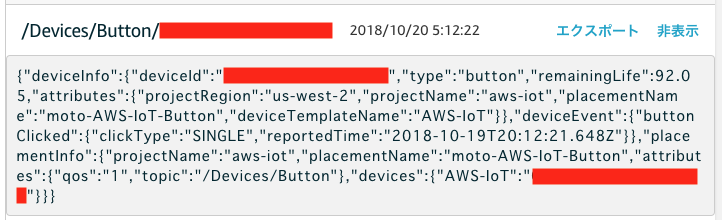

# AWS IoT 1-Click サービスから AWS IoT Core に連携するためのサンプル

## 準備
- AWS IoT Core の カスタムエンドポイント を確認する(オプション)
> AWS IoT ＞ 設定 から確認出来ます  
> 無指定の場合、data.iot.ap-northeast-1.amazonaws.com が使われます

## 使い方
### AWS Lambda の設定 (オプション)
`ENDPOINT` 環境変数として上記で確認した `xxxxxx-ats.ap-northeast-1.amazonaws.com` を指定します

### AWS 1-click 側の設定
- [AWS IoT 1-Click のコンソール](https://ap-northeast-1.console.aws.amazon.com/iot1click/home)を開きます。
- デバイスを登録します
- [プロジェクトを新規作成します](https://ap-northeast-1.console.aws.amazon.com/iot1click/home?region=ap-northeast-1#/create/project)
 - プロジェクト名 : `AWS-IoT` など
- プロジェクトのプレイスメントのテンプレートの定義 をします。
 - デバイステンプレート定義
 
 - プレイスメントの属性
 
   - 共通で使う属性の設定となります(それぞれをプレイスメント毎に上書きすることも出来ます)
   - QoS や Topic (実際に Publish される Topic にはデバイスIDが付与されます) を指定する事ができます (必須ではありません)
- プレイスメントを作成します
  - プレイスメントごとの属性をここでオーバーライドすること出来ます。例えば、異なる Topic にデータを送信したい場合には、個別の Topic を指定します

### AWS IoT 側でデータを確認する
AWS IoT のメニューから テスト を開いて、トピックのサブスクリプションで `#` を指定し、トピックへのサブスクライブを開始します。
ボタンをクリックすると、下記のようなクリックイベントメッセージが表示されます。

