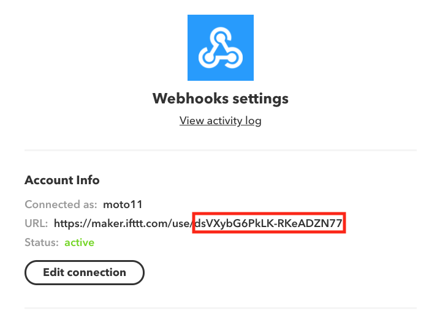

# AWS IoT 1-Click サービスから IFTTT に連携するためのサンプル

## 準備
- IFTTT のアカウントを開設する
- [Webhooks](https://ifttt.com/maker_webhooks)と接続(Connect)する
- 右上の ⚙ Settings から、設定を確認する
  - Account Info の URL 項目の、use の後ろの部分をメモしておく

## 使い方
### AWS 側の設定
- [AWS IoT 1-Click のコンソール](https://ap-northeast-1.console.aws.amazon.com/iot1click/home)を開きます。
- デバイスを登録します
- [プロジェクトを新規作成します](https://ap-northeast-1.console.aws.amazon.com/iot1click/home?region=ap-northeast-1#/create/project)
 - プロジェクト名 : IFTTT など
- プロジェクトのプレイスメントのテンプレートの定義 をします。
 - デバイステンプレート定義
 
 - プレイスメントの属性
 
   - 共通で使う属性の設定となります(それぞれをプレイスメント毎に上書きすることも出来ます)
   - **key は必須項目です、準備でメモしておいたものを入れます**
   - event は任意項目ですが、明示的に指定した場合には全て同一のイベントとして扱われます。もし IFTTT 側でクリックの種類ごとに異なるイベントを設定したい場合には `$clickType` と設定しておくと、SINGLE/DOUBLE/LONG というイベントがそれぞれ実行されます (省略した場合もこれと同じ挙動となります)
   - value1〜value3 は、Action として呼ばれるサービスに渡すパラメータとなります。デバイスのIDなどを渡すとメッセージ中などで引用することが出来ます。使える変数の種類は、[実際のコード](index.js#L8)を参照して下さい。
- プレイスメントを作成します
  - プレイスメントごとの属性をここでオーバーライドすること出来ます。例えば、異なる IFTTT アカウントの webhook を呼びたい時には、key を変えたり、イベント名を変えたりすることが出来ます

### IFTTT 側の設定
- 右上のユーザ名をクリック→ [New Applet](https://ifttt.com/create) をクリックするなどして、[Applet作成画面](https://ifttt.com/create)を開きます
- `+this`をクリックし、検索窓に `webhooks` と入れ、Webhooks アイコンをクリックします
- `Recieve a web request` をクリックします
- `Event Name` はプレイスメント属性で明示的に指定した場合にはその値(`BUTTON`等)を入れます。
  ※ もし`event`の設定を省略した場合には ** `SINGLE`/`DOUBLE`/`LONG` それぞれに Applet を作成する必要があるので、注意が必要です**
- `+that` をクリックし、`Action` を選びます (例えば Gmail など)
- `Action` の種類を選択し(例えば `Send yourself an email` )、フィールドを定義します
  - この際、`value1`/`value2`/`value3` や `EventName` を指定することで、クリックの種類やボタンの設置場所の名前などを件名やメッセージに含むことが出来ます
- 最後の画面で `Finish` を押すと、実際に `Applet` が実行されるようになりますので、忘れずに押して下さい

### 応用例
- スマートリモコンを使って、電灯の明るさを変える(クリックした時に通常の明るさ、ダブルクリックで最も明るい、長押しで消す、など)
