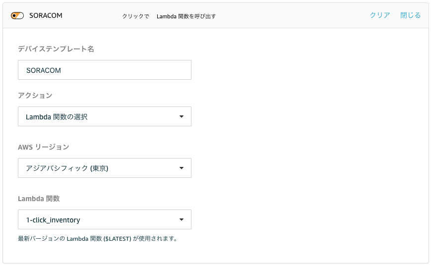
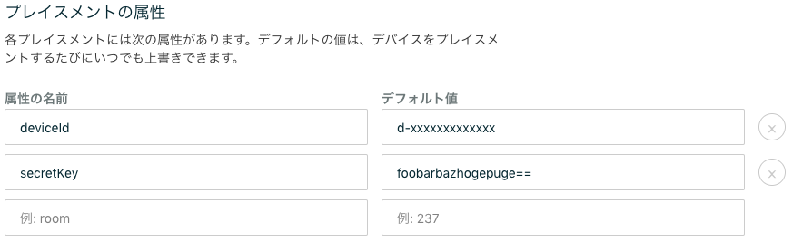
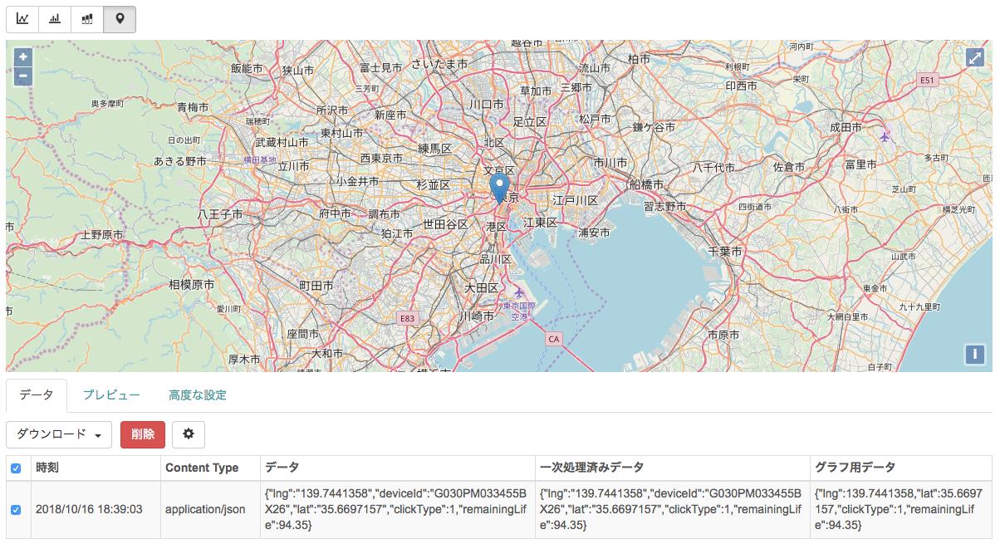

# AWS IoT 1-Click サービスから SORACOM Inventory を経由し、 Harvest に連携するためのサンプル

## 準備
- SORACOM のアカウントを開設する

## 使い方

### SORACOM 側の設定
- SORACOM Inventory のデバイスを作成し、デバイスID と シークレットキーをメモしておく

> 詳細な手順は、下記のガイドを参照してください  
> https://dev.soracom.io/jp/start/inventory_harvest_with_keys/

### AWS 側の設定
- [AWS IoT 1-Click のコンソール](https://ap-northeast-1.console.aws.amazon.com/iot1click/home)を開きます。
- デバイスを登録します
- [プロジェクトを新規作成します](https://ap-northeast-1.console.aws.amazon.com/iot1click/home?region=ap-northeast-1#/create/project)
 - プロジェクト名 : SORACOM など
- プロジェクトのプレイスメントのテンプレートの定義 をします。
 - デバイステンプレート定義
 
 - プレイスメントの属性
 
   - 共通で使う属性の設定となります(それぞれをプレイスメント毎に上書きすることも出来ます)
   - **deviceId と secretKey は必須項目です、準備でメモしておいたものを入れます**
- プレイスメントを作成します
  - プレイスメントごとの属性をここでオーバーライドすること出来ます。例えば、異なる Inventory デバイス としてデータを記録したい場合には、deviceId と secretKey を個別に指定する事が出来ます

### SORACOM 側でデータを確認する
- Inventory のデバイスを選択し、操作からデータを確認を選ぶと Harvest でデータを確認する事が出来ます

下記の例では、プレイスメントの属性として、ボタンを設置した場所の座標データを入れてあるので、クリックの種類(シングル=1)と座標データが Harvest に送られているので、地図上に点がプロットされています。

