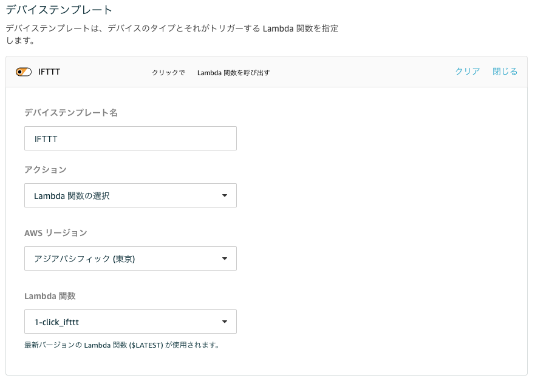

# AWS IoT 1-Click サービスから SORACOM Inventory を経由し、 Harvest に連携するためのサンプル

## 準備
## 使い方
### AWS 側の設定
- [AWS IoT 1-Click のコンソール](https://ap-northeast-1.console.aws.amazon.com/iot1click/home)を開きます。
- デバイスを登録します
- [プロジェクトを新規作成します](https://ap-northeast-1.console.aws.amazon.com/iot1click/home?region=ap-northeast-1#/create/project)
 - プロジェクト名 : IFTTT など
- プロジェクトのプレイスメントのテンプレートの定義 をします。
 - デバイステンプレート定義
 
 - プレイスメントの属性
 
   - 共通で使う属性の設定となります(それぞれをプレイスメント毎に上書きすることも出来ます)
   - **key は必須項目です、準備でメモしておいたものを入れます**
   - event は任意項目ですが、明示的に指定した場合には全て同一のイベントとして扱われます。もし IFTTT 側でクリックの種類ごとに異なるイベントを設定したい場合には `$clickType` と設定しておくと、SINGLE/DOUBLE/LONG というイベントがそれぞれ実行されます (省略した場合もこれと同じ挙動となります)
   - value1〜value3 は、Action として呼ばれるサービスに渡すパラメータとなります。デバイスのIDなどを渡すとメッセージ中などで引用することが出来ます。使える変数の種類は、[実際のコード](index.js#L8)を参照して下さい。
- プレイスメントを作成します
  - プレイスメントごとの属性をここでオーバーライドすること出来ます。例えば、異なる IFTTT アカウントの webhook を呼びたい時には、key を変えたり、イベント名を変えたりすることが出来ます

### SORACOM 側の設定
